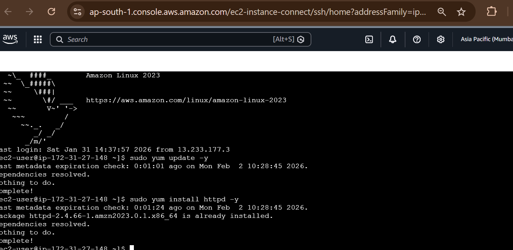

# Project 2: Deploy Web Server on EC2

## Objective
Deploy a web server on an EC2 instance using Apache.

## Services Used
- Amazon EC2
- Amazon Linux
- Apache HTTP Server

## Steps Performed
1. Launched EC2 instance
2. Connected using EC2 Instance Connect
3. Installed Apache web server
4. Created simple HTML file
5. Accessed website using public IP

## Outcome
Successfully deployed and accessed a web server on EC2.

## Screenshots
Screenshots are available in the screenshots folder.
## Screenshots

.
