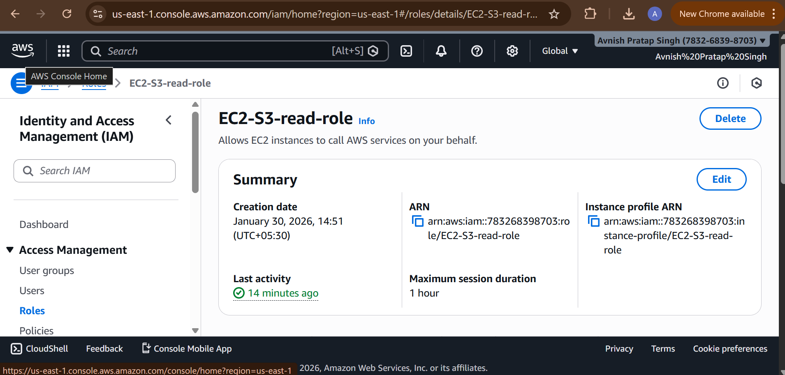
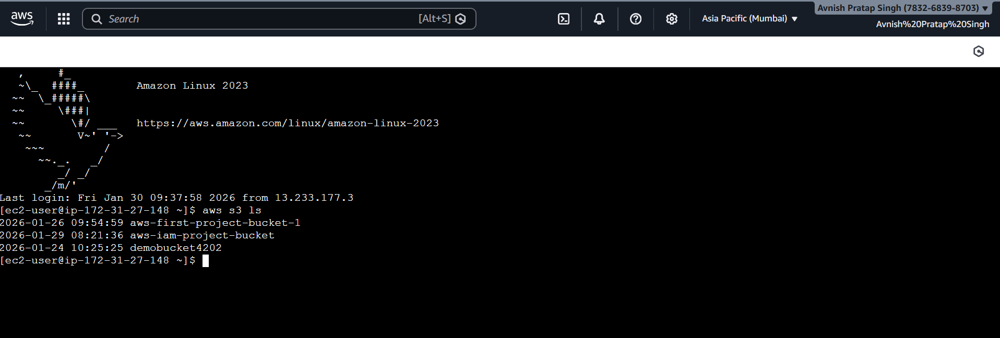

# Project 3: IAM Role Based Access to S3

## Objective
Access S3 bucket from EC2 securely using IAM role.

## Services Used
- IAM
- EC2
- S3

## Steps Performed
1. Created IAM role with S3 access
2. Attached IAM role to EC2 instance
3. Used AWS CLI to access S3 from EC2
4. Verified access without access keys

## Outcome
Successfully accessed S3 securely using IAM role.

## Screenshots
Screenshots are available in the screenshots folder.
# Screenshots

