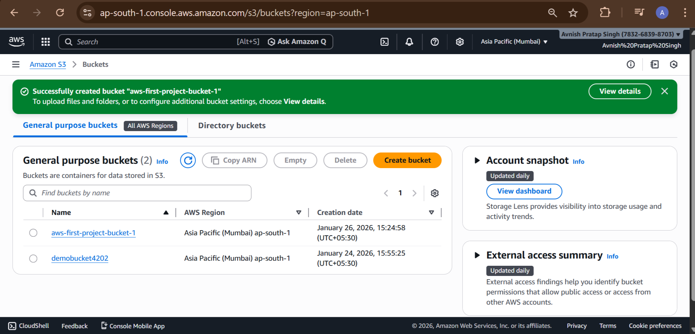
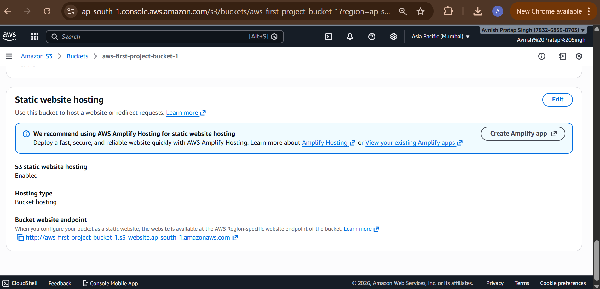

# Project 1: S3 Static Website Hosting

## Objective
Host a simple static website using Amazon S3.

## Services Used
- Amazon S3

## Steps Performed
1. Created an S3 bucket
2. Enabled static website hosting
3. Uploaded index.html file
4. Configured bucket policy for public access
5. Accessed website using S3 endpoint URL

## Outcome
Successfully hosted a static website on Amazon S3.

## Screenshots
Screenshots are available in the screenshots folder.
## Screenshots

