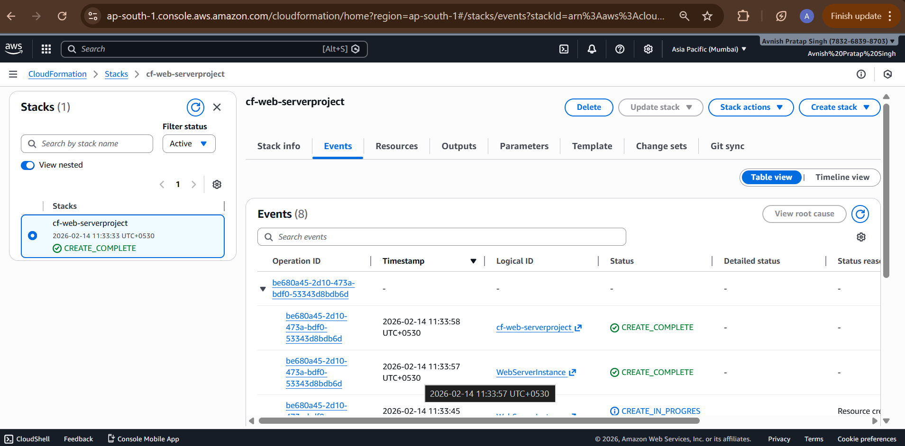
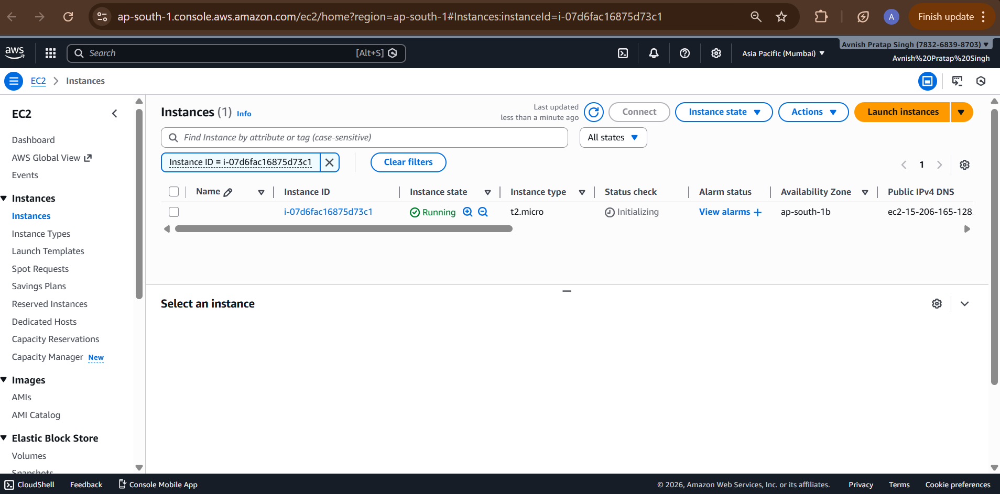
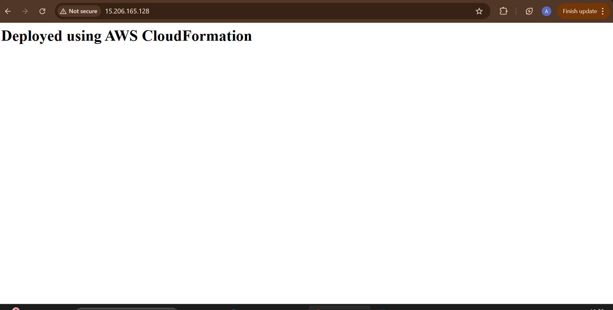

# AWS CloudFormation Web Server Project

## Description
This project demonstrates how to deploy a web server automatically using AWS CloudFormation.

## Services Used
- AWS CloudFormation
- Amazon EC2
- Security Groups
- Apache Web Server

## Features
- Automated infrastructure provisioning
- EC2 with Apache installed using UserData
- Publicly accessible website

## Outcome
A fully functional web server deployed using Infrastructure as Code.

## 📸 Screenshots

### Stack Created

### EC2 Running

### Website Output

